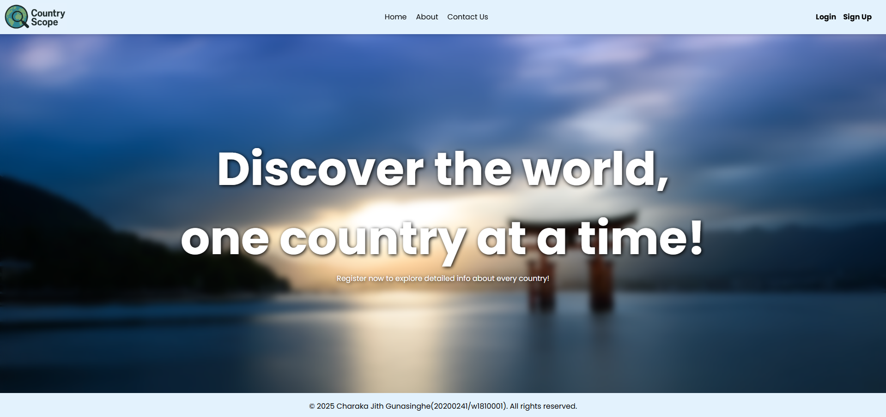

<div align="center">
  <h2 ="center">CountryScope</h2>
</div>



### This project is a secure API middleware service built for the Advanced Server-Side Web Development module (Coursework 01). It interfaces with RestCountries.com to fetch and filter country data including name, currency, capital, languages, and flag.

### The app features full user authentication, API key management, and secure data storage using SQLite with password hashing and session handling. It follows a polyglot architecture and is fully containerized with Docker for easy local deployment.

### Built With

- [![React][React.js]][React-url]
- [![Node][Node.js]][Node-url]
- [![Express][Express.js]][Express.js-url]
- [![Sequelize][Sequelize]][Sequelize-url]
- [![SQLite][SQLite]][SQLite-url]
- [![Docker][Docker]][Docker-url]
- [![Swagger][Swagger]][Swagger-url]

## Getting Started

### Prerequisites

- node.js: [Node.js download page](https://nodejs.org/en/download)
- React.js: [React official website](https://reactjs.org/)
- SQLite: [SQLite download page](https://www.sqlite.org/download.html)
- Docker: [Docker download page](https://www.docker.com/products/docker-desktop/)

### Installation

1. Clone the repo
   ```bash
   git clone https://github.com/CharakaJith/coursework_01_20200241_w1810001.git
   ```

### Start the project using Docker

1. Build the docker image
   ```bash
   docker-compose build
   ```
2. Run the container using image
   ```bash
   docker-compose up
   ```

### Start the project using terminal

1. Install NPM packages
   ```bash
   npm run install:all
   ```
2. Create database tables
   ```bash
   npm run migrate:up
   ```
3. Start the server and client
   ```bash
   npm run start
   ```

### Other scripts

1. Start the development server
   ```bash
   npm run dev
   ```
2. Start the client
   ```bash
   npm run server
   ```
3. Undo the most recent database migration
   ```bash
   npm run migrate:down
   ```
4. Undo all database migrations
   ```bash
   npm run migrate:down:all
   ```

## Assumptions

The following assumptions were made during the development of this project:

### 1. Environment Configuration

- The application runs in a Node.js environment (version 20.18.1).
- Environment variables are provided in a `.env` file.
- The app uses `NODE_ENV=development` or `NODE_ENV=production`.

### 2. Database

- **SQLite** is used for local development and testing.
- The database schema is designed in **Third Normal Form (3NF)** to reduce redundancy and ensure data integrity.
- **Sequelize** is used as the ORM for interacting with the SQLite database.
  - **Sequelize** provides a straightforward API for working with relational databases and allows for easy migrations and model definition.
  - It abstracts the complexity of SQL queries, making it easier to manage data and perform CRUD operations.
  - Sequelize supports multiple dialects (including SQLite, PostgreSQL, MySQL), providing flexibility for future changes to the database engine.
  - It also supports relationships between tables (one-to-many, many-to-many), making it suitable for complex data models.
- A `user` table is used to store user credentials and related information.
- `key` and `request` tables are used for API key generation, storage, and request tracking for rate limiting or auditing purposes.
- `country` and `currency` tables are used to store and manage session-related data where applicable.
- The database schema remains consistent across environments unless explicitly modified.

### 3. Authentication & Security

- Passwords are hashed securely (e.g., using bcrypt) before being stored in the database.
- User authentication is handled using **JSON Web Tokens (JWT)**, which are issued upon successful login and validated on protected routes.
- **API keys** are used to secure publicly exposed endpoints. Specifically, the `GET /countries` and `GET /countries/:id` endpoints require a valid API key.
- Each user can generate up to **two API keys** at a time.
- API keys are valid for **30 days** from the time of creation and can be **revoked by the user at any time**.
- API keys are stored and transmitted securely.
- Both API keys and JWT tokens have predefined expiration times to enhance security.

### 4. External APIs

- The RestCountries API is assumed to be available and stable.
- The structure of the API response is expected to remain consistent.

### 5. User Roles & Access

- Only authenticated users can access protected endpoints.
- No admin or multi-tier access roles are implemented unless explicitly stated.

### 6. Request & Response Handling

- Client requests are expected to be well-formed and follow the defined API contract.
- Errors are handled using appropriate HTTP status codes and clear response messages.

### 7. Dependencies & Tooling

- All dependencies are declared in the `package.json` file.
- ESLint is configured using a `.eslintrc.mjs` file.
- The codebase uses modern JavaScript (ES6+).

### 8. Logging

- The application uses **Winston** for logging, with log files rotating daily.
- Logs include details about HTTP requests, response status, and error messages.
- The log format includes timestamps, log levels, and structured JSON data.
- Error stack traces are logged only in development mode.
- Sensitive information is not logged.
- Logs are kept for **14 days** before being automatically deleted.

### 9. Error Handling

- The application uses a custom error handler to manage errors and send appropriate responses.
- Errors are logged using **Winston** with the log type depending on the error severity (`ERROR`, `FAIL`).
- The error handler responds with an appropriate HTTP status code and error message.
- In development mode, the full stack trace is included in the response for debugging purposes.
- Sensitive error details (like passwords or tokens) are not included in the logs or responses.

### 10. Architecture

- The application follows a layered architecture with the following structure:
  - **Client**: The front-end or external application that interacts with the API.
  - **Route**: Defines the HTTP routes and endpoints exposed to the client.
  - **Controller**: Handles incoming requests and delegates business logic to services.
  - **Service**: Contains the core business logic and operations.
  - **DAO (Data Access Object)**: Provides an abstraction layer for interacting with the database.
  - **Database**: The SQLite database is used for storing and managing data.

## Documentations

- [Postman API documentation](https://documenter.getpostman.com/view/28014836/2sB2ca7KxT)
- [System architecture diagram](https://lucid.app/lucidchart/2a483b63-3440-4489-8897-0be2bec5e6c0/edit?viewport_loc=-692%2C75%2C4037%2C1876%2C0_0&invitationId=inv_a37d0cd7-3207-4b11-aff4-4d38cec92698)
- [Entity relationship diagram](https://lucid.app/lucidchart/7f8a2968-8a84-4d4a-bd8a-6f496e6089f5/edit?viewport_loc=-518%2C203%2C2992%2C1391%2C0_0&invitationId=inv_c9636f5d-29ab-4624-bd44-f04850d3bada)

## Contact

Email: [charaka.info@gmail.com](mailto:charaka.info@gmail.com) | LinkedIn: [Charaka Jith Gunasinghe](https://www.linkedin.com/in/charaka-gunasinghe-6742861b9/)

<!-- MARKDOWN LINKS & IMAGES -->

[React.js]: https://img.shields.io/badge/React-20232A?style=for-the-badge&logo=react&logoColor=61DAFB
[React-url]: https://reactjs.org/
[Node.js]: https://img.shields.io/badge/Node.js-12A952?style=for-the-badge&logo=node.js&logoColor=white
[Node-url]: https://nodejs.org/en
[Express.js]: https://img.shields.io/badge/Express.js-000000?style=for-the-badge&logo=express&logoColor=white
[Express.js-url]: https://expressjs.com/
[SQLite]: https://img.shields.io/badge/SQLite-003B57?style=for-the-badge&logo=sqlite&logoColor=white
[SQLite-url]: https://sqlite.org/download.html
[Docker]: https://img.shields.io/badge/Docker-2496ED?style=for-the-badge&logo=docker&logoColor=white
[Docker-url]: https://www.docker.com/
[Swagger]: https://img.shields.io/badge/Swagger-85EA2D?style=for-the-badge&logo=swagger&logoColor=black
[Swagger-url]: https://swagger.io/
[Sequelize]: https://img.shields.io/badge/Sequelize-52B0E7?style=for-the-badge&logo=sequelize&logoColor=white
[Sequelize-url]: https://sequelize.org/
